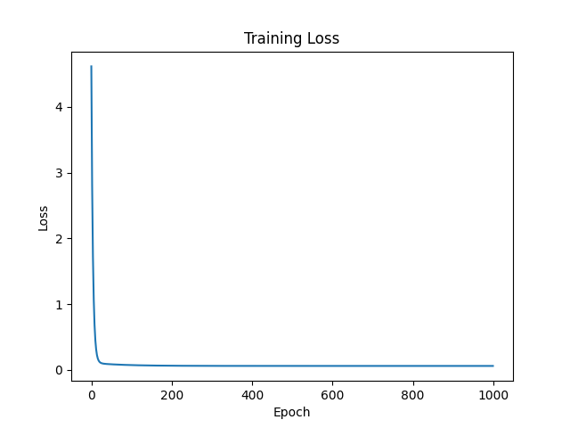

# **Machine Learning and Statistical Linear Regression Analysis**

## Description
This project is more of a study to understand the relationship between simple statistics and machine learning. The main goal is to implement a simple linear regression model using the least squares method and compare the results using both numpy and PyTorch (read note below for more info) and the MSE loss function in an attempt to find similar lines of best fit.

> [!NOTE]
> 1. There are two directories under 'src'. One is for the numpy/scratch implementation of the linear regression model, and the other is for the PyTorch implementation. The two directories have a very similar data.py file, but one uses numpy and the other uses PyTorch to generate synthetic data (this was a choice to practice using both libraries).
> 2. The two numpy and PyTorch implementations cover the same concept. The only real difference is that the numpy version deals with **scalars** rather than **tensors**, which is what PyTorch uses.
> 3. So, the results are practically identical between the two. When referring to e.g. the 'inference.py' file, the two methods are interchangeable.

## Project/Study Details
### **Data**
The data.py file generates synthetic data based on a given slope and intercept. It creates a data set composed of explanatory and response variables.

You can run the data.py file to see the generated data. The data is plotted using matplotlib, of course.

### **train and inference scripts**
These scripts contain the code to train (train.py) a simple linear regression model based on the synthetic data, and the inference (inference.py) script to predict the response variable based on the explanatory variable.

As an example, sugar content is the explanatory variable, and the calories are the response variable. The model will predict the calories based on the sugar content. In reality though, our data is meaningless.

Loss function used for training: MSE loss (Mean Squared Error)



The losses plotted above are rather average epoch losses, so it uses average loss reporting.

### **Results**
When running the inference script after we have trained our model, we get the output:
```
Random seed: 42
Number of parameters: 2

Model's Predicted Line:
Predicted Line: y = 1.8597915172576904x + 1.0682505369186401
Slope: 1.8597915172576904, Intercept: 1.0682505369186401

Statistical Predicted Line (Least squares method):
Predicted Line: y = 1.8614728450775146x + 1.0692236423492432
Slope: 1.8614728450775146, Intercept: 1.0692236423492432
```

Immediately, we can see that the results are very close between the statistical linear regression model and the machine learning model.

We can also gather the point-slope form of both our statistical linear regression model and the machine learning model.

Of course, the results will vary based on epochs, learning rate, and other hyperparameters, even those that affect the synthetic data generated.

During inference, the results are plotted using matplotlib and displayed. As an example with the seed set to 42:

Machine Learning model line:


Statistical linear regression line:


Then, we can also plot a graph displaying the machine learning model's predicted values alongside the actual data values:


Using MSESquared loss, the result is the same as the statistical linear regression model, which is expected, as the statistic model is based on the least squares method, which minimizes the squares of the residuals.

### **Conclusion**

Simple statistics and machine learning can be easily related, and this is a good way to learn such concepts. Machine learning can be used for more complex problems, but it is always good to understand the basics.

Machine learning can be easily implemented using PyTorch to create multi-variable (more than one dependent/independent variable) linear regression models, making it more powerful than simple statistics in a lot of cases.

**Note**

Although there is a config file for this project, it still has not been implemented in the code completely. The config file will be used to set hyperparameters and other variables.

**ALSO**, for those looking at past commits, this repo was originally made to test out different machine learning and statistics relationships. However, I changed the scope of the repo to be focused solely on the relationship of linear regression between machine learning and statistic models. So yes, I am aware that past commits may have file names that don't apply directly to the current scope of the project.

**Useful resources related to the topic:**
- [Simple Linear Regression](https://www.kaggle.com/code/devzohaib/simple-linear-regression)
- [Linear Regression](https://en.wikipedia.org/wiki/Linear_regression)
- [Least Squares Method](https://en.wikipedia.org/wiki/Least_squares)
- [MSE (Mean Squared Error)](https://en.wikipedia.org/wiki/Mean_squared_error)

**Project Future**

This project will probably be maintained lightly in the future from here on out. Making the code clearer and more concise is a goal, as well as implementing the config file to set hyperparameters and other variables.
Perhaps, putting the code in jupyter notebooks for better visualization and understanding of the code is another idea that can be implemented in the future.